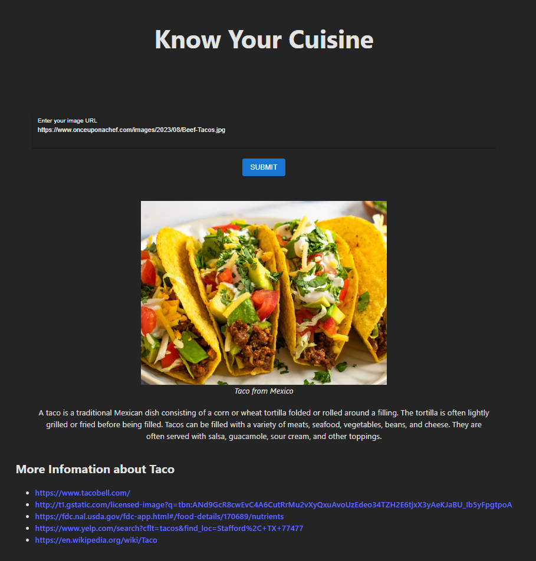

# HCCHackathon
The app uses Image to Text models to create captions and then using Gemini's model to extend the input and build query to perform searches about food and culture/cuisines.




# How To Run It
In `backend`:

Install dependencies:
```bash
pip install -r requirements.txt
```
Run the flask instance `python main.py`

In `react`:

Install dependencies
```bash
npm install
```

Run the react app `npm run dev` and the app will be live at `http://localhost:5173`